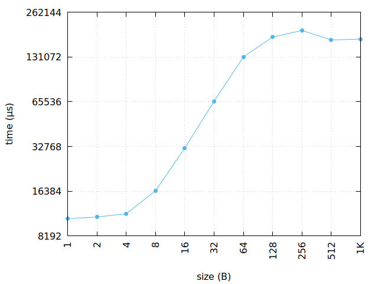
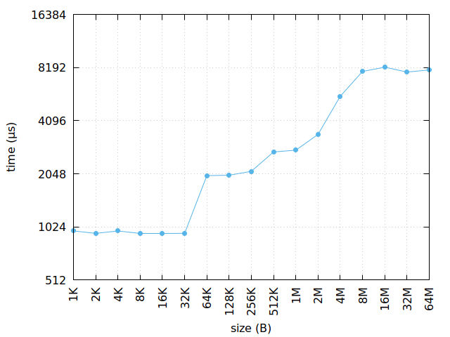
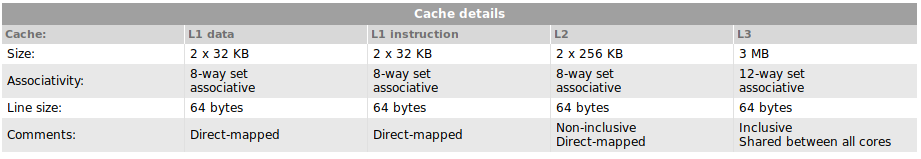

Práctica 5: Cache
===

`line.cc`
---

Genera un conjunto de valores de tiempo para el acceso en un array,
con un entero `i` como incremento.

En el momento que el tiempo se estabiliza en un punto, sabemos que hemos 
llegado a el tamaño de línea de nuestro ordenador.

Esta gráfica tiene esta forma porque a medida que aumentamos el incremento
del bucle, se producen más fallos y se pierde más tiempo en cada acceso.

\newpage

`size.cc`
---

Genera un conjunto de valores de tiempo para pequeñas modificaciones de un
array de tamaño variable `n`.

En el momento que se desestabiliza, podemos intuir que el tamaño del array ha
alcanzado un tamaño mayor del que cabe en la memoria cache de cierto nivel.

\newpage

Carácteristicas del sistema
---

`make info`:  

    > line size = 64B
    > cache size = 32K/32K/256K/3072K/
    > cache level = 1/1/2/3/
    > cache type = Data/Instruction/Unified/Unified/

`lscpu`:  

    > Architecture:          x86_64
    > CPU op-mode(s):        32-bit, 64-bit
    > Byte Order:            Little Endian
    > CPU(s):                4
    > On-line CPU(s) list:   0-3
    > Thread(s) per core:    2
    > Core(s) per socket:    2
    > Socket(s):             1
    > NUMA node(s):          1
    > Vendor ID:             GenuineIntel
    > CPU family:            6
    > Model:                 58
    > Model name:            Intel(R) Core(TM) i5-3230M CPU @ 2.60GHz
    > Stepping:              9
    > CPU MHz:               1376.013
    > CPU max MHz:           3200,0000
    > CPU min MHz:           1200,0000
    > BogoMIPS:              5188.20
    > Virtualization:        VT-x
    > L1d cache:             32K
    > L1i cache:             32K
    > L2 cache:              256K
    > L3 cache:              3072K
    > NUMA node0 CPU(s):     0-3
    > Flags:                 fpu vme de pse tsc msr pae mce cx8 apic sep mtrr 
    >                        pge mca cmov pat pse36 clflush dts acpi mmx fxsr
    >                        sse sse2 ss ht tm pbe syscall nx rdtscp lm 
    >                        constant_tsc arch_perfmon pebs bts rep_good nopl
    >                        xtopology nonstop_tsc aperfmperf eagerfpu pni
    >                        pclmulqdq dtes64 monitor ds_cpl vmx est tm2 ssse3
    >                        cx16 xtpr pdcm pcid sse4_1 sse4_2 x2apic popcnt
    >                        tsc_deadline_timer aes xsave avx f16c rdrand 
    >                        lahf_lm epb tpr_shadow vnmi flexpriority ept vpid
    >                        fsgsbase smep erms xsaveopt dtherm ida arat pln pts

CPU-World:  
 

